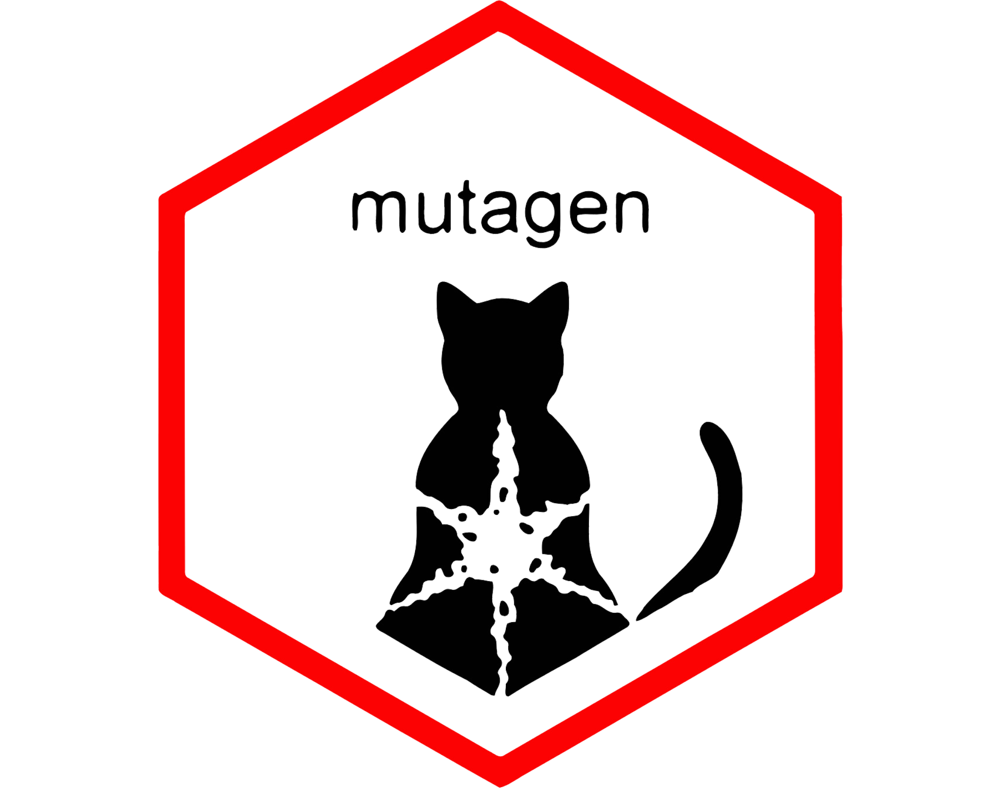

<!-- README.md is generated from README.Rmd. Please edit that file -->

# mutagen 

> The issue is of human time rather than silicon chip time. Human time
> can be wasted by taking longer to write the code, and (often much more
> importantly) by taking more time to understand subsequently what it
> does.
>
> – [*The R
> Inferno*](https://www.burns-stat.com/documents/books/the-r-inferno)
> *(Patrick Burns, 2011)*

------------------------------------------------------------------------

<!-- badges: start -->

[](https://github.com/gvelasq/mutagen/actions/workflows/R-CMD-check.yaml)
[](https://app.codecov.io/gh/gvelasq/mutagen)
[](https://CRAN.R-project.org/package=mutagen)
[](https://gvelasq.r-universe.dev/mutagen)
[](https://www.tidyverse.org/lifecycle/#experimental)

<!-- badges: end -->

The goal of mutagen is to provide extensions to dplyr’s
[`mutate()`](https://dplyr.tidyverse.org/reference/mutate.html).

mutagen provides simple-to-use functions as alternatives to complex R
idioms for variable generation. Some mutagen functions are specific to
problems encountered in R (e.g., working with list-columns in a data
frame), while others solve more generic data science operations that are
inspired by the excellent set of
[`egen`](https://www.stata.com/manuals/degen.pdf) (‘**e**xtensions to
**gen**erate’) and [`egenmore`](https://ideas.repec.org/c/boc/bocode/s386401.html) functions in Stata.

## Installation

You can install the development version of mutagen from
[GitHub](https://github.com) with:

``` r
# install.packages("devtools")
devtools::install_github("gvelasq/mutagen")
```

## Usage

mutagen functions begin with the prefix `gen_*` and are designed to be
used inside dplyr’s `mutate()`. A mnemonic for this is that to use
mutagen, first **muta**te then **gen**erate.

| mutagen function | R idiom[^1] | Stata function |
|----|----|----|
| `gen_na_listcol()`[^2] | `modify_tree(leaf = \(x) replace(x, is.null(x), NA))` | `N/A` |
| `gen_percent()` | `mutate(data, pct = col / sum(col) * 100, .by = group_cols)` | `egen pc` |
| `gen_rowany()`[^2] | `pmap_int(data, \(cols) any(list(cols) %in% values))` | `egen anymatch`, `egenmore rany` |
| `gen_rowcount()`[^2] | `pmap_int(data, \(cols) sum(list(cols) %in% values))` | `egen anycount` |
| `gen_rowfirst()`[^2] | `pmap_vec(data, \(cols) first(c(cols), na_rm = TRUE))` | `egen rowfirst` |
| `gen_rowlast()`[^2] | `pmap_vec(data, \(cols) last(c(cols), na_rm = TRUE))` | `egen rowlast` |
| `gen_rownth()`[^2] | `pmap_vec(data, \(cols) nth(c(cols), n, na_rm = TRUE))` | `N/A` |
| `gen_rowmax()` | `inject(pmax(!!!data, na.rm = TRUE))` | `egen rowmax` |
| `gen_rowmean()`[^2] | `pmap_dbl(data, \(cols) mean(c(cols), na.rm = TRUE))` | `egen rowmean` |
| `gen_rowmedian()`[^2] | `pmap_dbl(data, \(cols) median(c(cols), na.rm = TRUE))` | `egen rowmedian` |
| `gen_rowmin()` | `inject(pmin(!!!data, na.rm = TRUE))` | `egen rowmin` |
| `gen_rowmiss()`[^2] | `pmap_int(data, \(cols) sum(!complete.cases(c(cols))))` | `egen rowmiss` |

## Contributing

Please note that the mutagen project is released with a [Contributor
Code of Conduct](.github/CODE_OF_CONDUCT.md). By contributing to this
project, you agree to abide by its terms.

## Contributors

<!-- ALL-CONTRIBUTORS-LIST:START - Do not remove or modify this section -->

<!-- prettier-ignore-start -->

<!-- markdownlint-disable -->

All contributions to this project are gratefully acknowledged using the
[`allcontributors` package](https://github.com/ropensci/allcontributors)
following the [all-contributors](https://allcontributors.org)
specification. Contributions of any kind are welcome!

### Code

<table>

<tr>

<td align="center">

<a href="https://github.com/gvelasq">

</a><br>
<a href="https://github.com/gvelasq/mutagen/commits?author=gvelasq">gvelasq</a>
</td>

<td align="center">

<a href="https://github.com/ivelasq">

</a><br>
<a href="https://github.com/gvelasq/mutagen/commits?author=ivelasq">ivelasq</a>
</td>

</tr>

</table>

### Issues

<table>

<tr>

<td align="center">

<a href="https://github.com/delabj">

</a><br>
<a href="https://github.com/gvelasq/mutagen/issues?q=is%3Aissue+author%3Adelabj">delabj</a>
</td>

<td align="center">

<a href="https://github.com/thomascwells">

</a><br>
<a href="https://github.com/gvelasq/mutagen/issues?q=is%3Aissue+author%3Athomascwells">thomascwells</a>
</td>

</tr>

</table>

<!-- markdownlint-enable -->

<!-- prettier-ignore-end -->

<!-- ALL-CONTRIBUTORS-LIST:END -->

[^1]: The code shown in this column is pseudocode.

[^2]: Parallelization is supported via
    [purrr::in_parallel()](https://purrr.tidyverse.org/reference/in_parallel.html).
