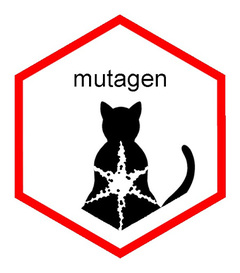

<!-- README.md is generated from README.Rmd. Please edit that file -->

# mutagen 

<!-- badges: start -->

[](https://www.tidyverse.org/lifecycle/#experimental)
[](https://CRAN.R-project.org/package=mutagen)
[](https://travis-ci.org/gvelasq/mutagen)
[](https://codecov.io/gh/gvelasq/mutagen?branch=master)
<!-- badges: end -->

The goal of mutagen is to provide extensions to dplyr’s `mutate()`.

## Installation

You can install the development version of mutagen from
[GitHub](https://github.com) with:

``` r
# install.packages("devtools")
devtools::install_github("gvelasq/mutagen")
```

Please note that the mutagen project is released with a [Contributor
Code of Conduct](.github/CODE_OF_CONDUCT.md). By contributing to this
project, you agree to abide by its terms.
